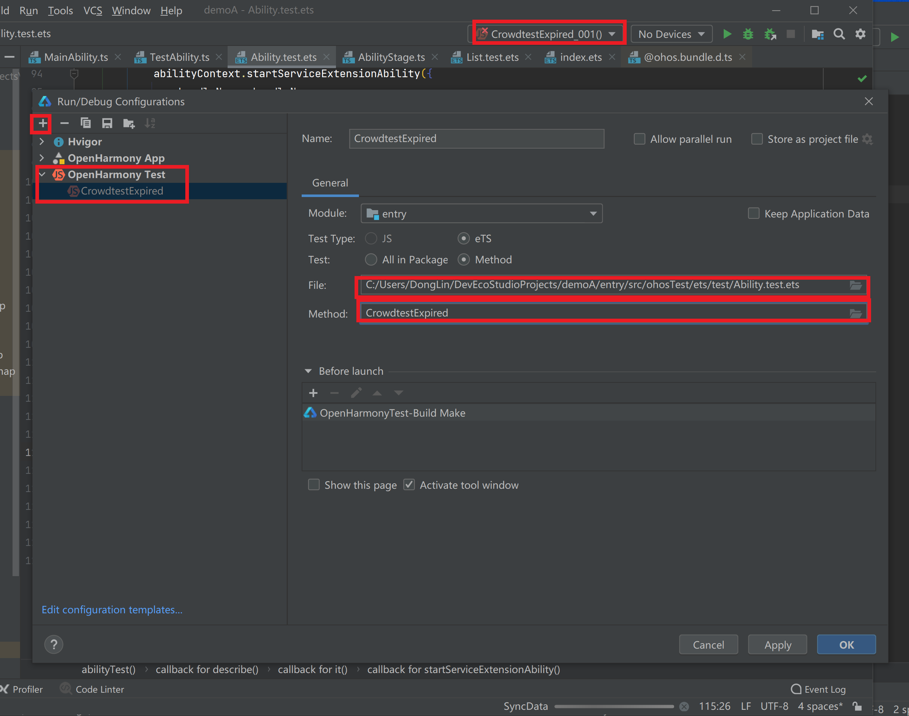

# 单元测试

在没掌握单元测试方法前，我是通过编写demo的前端页面，通过点击事件和跟踪日志去验证功能的实现。

通过学习[黄师伟/AMSStageDemo](https://gitee.com/huangshiwei4/amssdemo?_from=gitee_search)的教程，一步步实现单元测试样例，完成自己的单元测试，可以避免去实现前端页面，可以直接在单元测试函数里调用功能逻辑验证的函数，再通过assert断言的方式去判断样例是否通过。

## 一、生成配置文件

1. 从[每日构建](http://ci.openharmony.cn/dailys/dailybuilds)里下载ohos-sdk，或者在已下载好的OpenHarmony全量代码中通过命令`./build.sh --product-name ohos-sdk`编译在生成ohos-sdk

2. 在目录ohos-sdk\windows\toolchains下找到idl.exe文件和目录foudation\ability\idl_tools下的IIdlTestService.idl一起通过执行命令`idl.exe -c IIdlTestService.idl -gen-ts -d D:\IDL\ts`可以对应目录D:\IDL\ts下生成三个ts文件

3. 将这三个ts文件放在我们编写的需要测试的demo应用下

## 二、测试用例编写

测试用例的编写向Java的单元测试一样，describe描述的是整体需要测试的内容即测试套，it描述的是具体测试的用例

## 三、测试用例的运行

1. 将demo应用编译

    

从调试里配置新的run/debug配置，选好我们编写好的测试套或测试用例，就可以运行和调试了，也可以像教程里通过单个文件右击的形式进行运行。

2. 如果有想要调试的内容，可以将刚才build后的unsign文件使用自己的签名文件进行签名，再通过命令行的形式上传到设备上进行测试。
   
   ```shell
   hdc_std.exe app install D:\amssdemo-master\hap\entry-ohosTest-signed.hap
   hdc_std.exe shell aa test -b com.example.amsstageapplication -m entry_test -s unittest OpenHarmonyTestRunner -s class AutomationStageTest -s timeout 15000
   pause
   ```

    可以将以上命令编辑到一个bat脚本中进行运行。-b后跟的是自己demo的包名，-m后跟的是自己测试的模块名，可以在test目录下的module.json5文件中查看

3. 点击脚本，就进入测试查看测试样例通过数和错误数。
