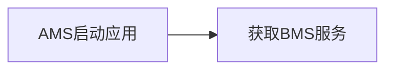

## SR000H7NBV 【运行管理支持待处置应用拦截】



获取bms服务类

```cpp
auto bms = GetBundleManager();
CHECK_POINTER_AND_RETURN(bms, ERR_INVALID_VALUE);
// 获取bundleName
std::string bundleName = want.GetBundle();
// auto bundleName = want.GetBundle();

// 调用bms接口GetDisposedStatus()获取处置状态
if (bms->GetDisposedStatus(bundleName)) {
    // 为处置应用
} else {
    // 为非处置应用
}
```

对于待处置应用处理：

- 后台启动（无界面）直接拒绝

- 前台启动，通过相关action隐式拉起应用市场的处置界面

## SR000H7N9B 【新增特性】运行管理支持众测应用

获取bms服务类

```cpp
auto bms = GetBundleManager();
CHECK_POINTER_AND_RETURN(bms, ERR_INVALID_VALUE);
// 获取bundleName
std::string bundleName = want.GetBundle();
// auto bundleName = want.GetBundle();


// 调用bms接口GetApplication()获取ApplicationInfo信息
AppExecFwk::ApplicationInfo callerAppInfo;
bool result = IN_PROCESS_CALL(
    bms->GetApplicationInfo(bundleName, \
        AppExecFwk::BundleFlag::GET_BUNDLE_DEFAULT, \
        GetUserId(), callerAppInfo)
);
if (!result) {
    HILOG_ERROR("GetApplicationInfo from bms fail.");
    return RESOLVE_CALL_NO_PERMISSIONS;
}


// 获取众测应用
auto appDistributionType = callerAppInfo.appDistributionType; //string
if (appDistributionType == AppExecFwk::Constants::APP_DISTRIBUTION_TYPE_CROWDTESTING){
    // 为众测应用
    // 到期时间获取

} else {
    // 为非众测应用
}
```

对于众测应用处理

- 众测应用到期，后台启动直接拒绝

- 众测应用到期，前台启动通过相关action隐式拉起应用市场的到期处理界面，进行众测到期引导

- 众测应用未到期，原逻辑

- 非众测应用，原逻辑
