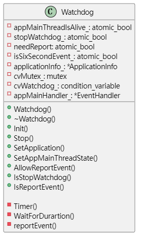

# DFX是什么

DFX是Design For X，这里的X可以是可靠性Reliability、可用性Availability、安全性Security、性能Performance等等。DFX顾名思义，面向产品生产的设计，其目的是在设计过程中尽早考虑后续阶段，从而对生产过程中的性能、规范做出约束，即在设计阶段就解决生产环境可能出现的一些问题并考虑解决措施。DFX通常作为设计中的附加要求、非功能性要求，不单独体现，对主功能的实现不做要求，在软件类产品上主要是可靠性、可服务性、安全性。

## 可靠性

就像代码中的try-catch一样，需要对异常情况except作出相应处理，从而保证程序的运行。当用户搜索时，拼写单词某个字母错误，仍能收到正确的搜索结果。或者当服务器宕机后，服务器请求能请求到其他备用服务器。

## 可服务性

可服务性量化标准一般基于用户体验、客户满意度去体现的。例如用户点击一个页面，需要多久时间才能收到服务器返回，5s内还是10s内，最好是无感知，让用户感知不到等待的过程。

应用的老年适配版，针对特定人群对页面显示作出改进，提升这部分人群的使用体验，提高了可服务性。

## 安全性

信息泄露，隐私保护

安全管理和安全策略

访问认证控制，数据加密，数据完整性

## 哪些是DFX

在OpenHarmony中哪些是DFX的内容

### 一、日志

HiLog，HiLog主要的特性是支持Js/Java/C/C++多语言的日志采集功能，还提供日志分类查询和流量控制。

### 二、事件

HiView是OpenHarmony中的事件框架，分为应用事件框架HiAppEvent和系统事件框架HiSysEvent。每个子系统可以通过HiAppEvent和HiSysEvent的事件采集接口上传，还可以从HiView处通过接口订阅事件。

### 三、跟踪

HiTrace在OpenHarmony中提供跟踪应用间、进程间的交互过程的能力，和跨设备跟踪程序交互过程的能力。

### 四、故障管理

除了上面专门的DFX模块用于维护系统的可靠性、稳定性，在每个子系统中还存在内嵌的DFX设计确保OpenHarmony应用程序的可执行性。

#### 1. 进程崩溃

#### 2. 应用生命周期切换超时检测

AMS提供了HandleLoadTimeOut(int64_t eventId)、HandleActiveTimeOut(int64_t eventId)、HandleInactiveTimeOut(int64_t eventId)、HandleForegroundTimeOut(int64_t eventId)、HandleBackgroundTimeOut(int64_t eventId)不同接口用于处理不同的超时情况

Timeout

HandleLoadTimeout

#### 3. 应用卡死

ANR(AppNotResponce)，是指应用程序未响应。在一些事件需要在一定时间范围内完成，如果超过预定时间未能得到有效响应或响应时间过长，都会造成ANR。一般这时会弹出一个提示框，告知用户当前app未响应，用户可选择等待或强制结束。

###### ams的anr监听

当出现ANR时，系统会调用AMS.appNotResponding()方法。

1. AMS在初始化的时候会注册ANR监听器并放入InputManager中，并定义ANR处置器处理ANR事件。ANR事件由InputManager中的监听器对象触发`OnAnr()`，调用AMS中的`SendANRProcessID(pid)`函数。

2. `SendANRProcessID(pid)`函数会调用AppNoResponseDisposer对象的`DisposeAppNoResponse()`方法，处理ANR事件。

3. 在AppNoResponseDisposer的`DisposeAppNoResponse()`方法中，会先获取到AppScheduler，通过AppScheduler获取到pid相关的app信息，杀死pid进程。

4. 如果系统支持图像，还会显示对话框

5. 最后AppNoResponseDisposer向abilitMgr线程发送杀死进程的超时任务PostTimeoutTask()

##### application主线程卡死

应用主线程卡死检查通过一个watchdog执行定时任务，每隔3s检测主线程状态。watchdog为主线程创建的一个子线程，watchdog内部还有一个匿名线程运行定时任务，该定时任务比较像Android中的service超时机制，

1. watchdog中的匿名线程每三秒会先向watchdog线程发送一个延时3s的超时上报任务

2. 该匿名线程向main thread发送查询主线程状态事件

3. main thread处理该事件，向watchdog线程发送main thread存活事件

4. watchdog处理main thread存活事件，及时移除1中发送的超时上报任务

如果主线程响应事件超时，即步骤3超时，就不能及时阻止超时上报，认定主线程超时卡死。

##### input超时

input超时通过InputReader读取输入事件，将输入事件放入队列中，并通知处理事件。

当input执行某次事件的耗时超过timeout时长，后续每一个事件检测到前一个事件超时，则作出ANR响应。

#### 4. 系统死机

### 五、信息导出工具

#### 1. dump

#### 2. 其他调优工具
