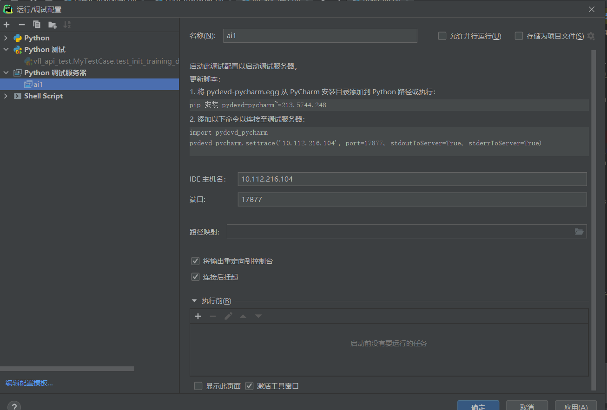

# Python单元测试

Java中一般使用JUnit框架进行单元测试，Python中可以使用unittest进行单元测试。

> https://juejin.cn/post/6844903938878095374

**为什么进行单元测试？**

- 降低运行成本，方便部分代码的测试运行
- 方便进行目标代码的调试运行
- 方便修改代码，以及检测bug


**怎样进行单元测试？**

- 声明和参数
- 准备入参和mock
- 调用需要测试的函数和代码
- 验证，也叫断言

```python
import unittest

class TestStringMethods(unittest.TestCase):

    def test_upper(self):
        self.assertEqual('foo'.upper(), 'FOO')

    def test_isupper(self):
        self.assertTrue('FOO'.isupper())
        self.assertFalse('Foo'.isupper())

    def test_split(self):
        s = 'hello world'
        self.assertEqual(s.split(), ['hello', 'world'])
        # check that s.split fails when the separator is not a string
        with self.assertRaises(TypeError):
            s.split(2)

if __name__ == '__main__':
    unittest.main()
```

通过内置断言方法判断被测对象行为是否符合预期：

- 在 `test_upper` 测试中，使用assertEqual检查是否是预期值

- 在 `test_isupper` 测试中，使用assertTrue或assertFalse验证是否符合条件

- 在 `test_split` 测试中，使用assertRaises验证是否抛出一个特定异常

除了使用断言也可以使用直接输出的方式查看。


## PyCharm远程调试

> https://www.jetbrains.com/zh-cn/pycharm/features/debugger.html
> https://www.cnblogs.com/xuegqcto/p/8621689.html

通过配置PyCharm远程调试，可以直接使用服务器的环境进行代码调试。



选择远程运行环境，打上断点运行代码调试