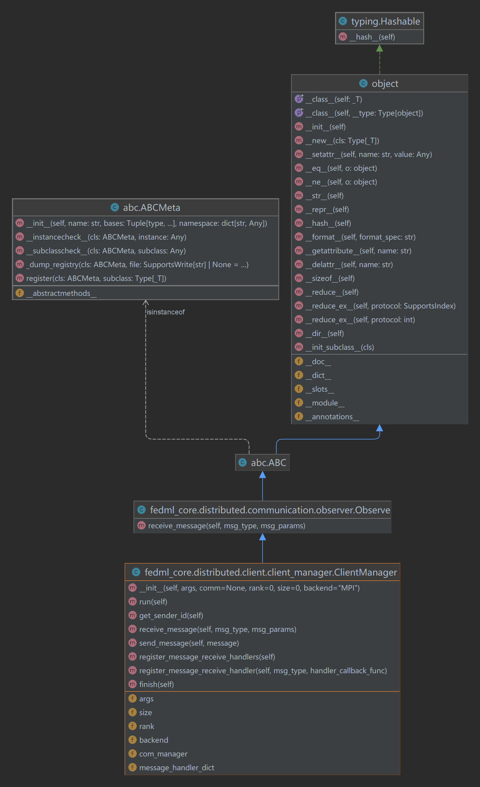
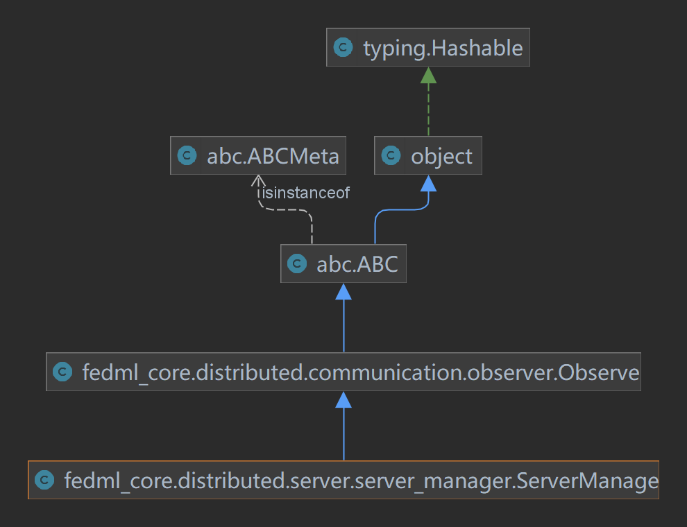
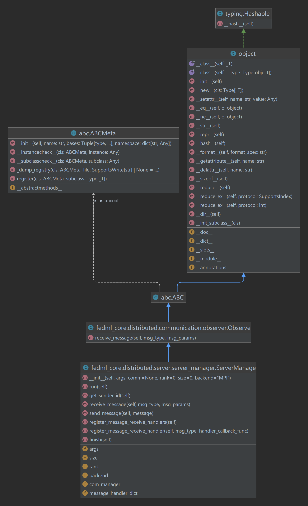
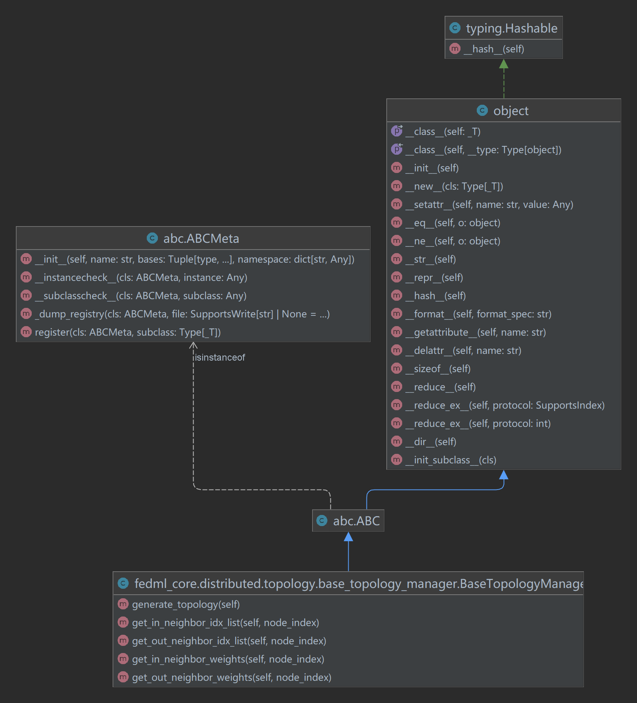

# FedML-Core

FedML-core主要有两个核心组件——**通信协议组件**与**模型训练组件**

## 通信协议组件

### ClientManager

在FedML中通过一个ClientManager的类进行通信管理。在ClientManager中可通过`backend`的变量参数值进行通信协议的替换，目前可选的通信协议有：

- MPI
- MQTT
- GRPC
- TRPC
- 默认使用MPI通信协议

使用`run()`方法执行ClientManager的监听信息处理器和信息发送处理器，具体被封装的方法是`register_message_receive_handlers()`和`com_manager.handle_receive_message()`。这两个方法需要在具体使用时自己实现。

### ServerManager

在ServerManage类中也是通过run()方法运行。实现方法与ClientManager一样。内部的不同仍需要看具体实现。

## 模型训练组件

> 学习trainer接口位置：FedML/fedml_core/trainer/model_trainer.py

FedML的深度学习组件基于深度学习框架TensorFlow或PyTorch构建。

FedML编程接口的理念：提供最简单的用户体验

### 例子：实现一个trainer

抽象类**`ModelTrainer()`**:

- `train()`
- `test()`
- `test_on_the_server()`

实现类**`MyModelTrainer()`**

- `train(self, train_data, device, args)`实现：

  - `self`：类MyModelTrainer的变量数据
  - `train_data`：训练数据
  - `device`：cpu或gpu训练
  - `args`：一些训练的其他参数，如epochs，lr，wd等

  模型训练过程先加载好模型model，在根据args定义好训练过程中的各种参数，然后开始epoch轮次的训练，train方法可以

- `test(self, test_data, device, args)`实现

  各入参定义与train()中一样。

  进行模型的验证测试。

## 其他工具组件

### non_iid_partiton

在*non_iid_partition.py*中提供了用于数据集划分的工具方法，主要用于非独立分布数据集划分。可实现单种类别和多种类别（分片）的数据集划分。

## 拓扑管理

对于联邦学习中的不同拓扑定义，如中心化、去中心化、分查结构，垂直结构，分片结构，FedML提供了TopologyManager的拓扑管理类接口允许用户在训练期间向任意节点成员发送消息。对于网络中的每一个trainer，都可以通过TopologyManager查询到其worker ID。

以上是BaseTopologyManager定义的五个接口方法，具体实现在FedML中有`SymmetricTopologyManager`类和`AsymmetricTopologyManager`类。

### SymmetricTopologyManager

对称拓扑管理类

属性：

- n: 协议节点数量
- neighber_num: 每个节点的邻居节点数量
- topology: 拓扑信息

方法：

- `generate_topology`： 初始化拓扑信息
- `get_in_neighber_weights`: 获取邻居节点输入权重信息
- `get_out_neighbor_weights`: 获取邻居节点输出权重信息
- `get_in_neighbor_idx_list`：获取所有邻居节点输入权重信息
- `get_out_neighbor_idx_list`：获取所有邻居节点输出权重信息

### AsymmetricTopologyManager

非对称拓扑管理类

属性：

- n: 协议节点数量
- undirected_neighbor_num: 每个节点无向连接节点数量
- out_directed_neighbor: 每个节点输出节点数量
- topology: 拓扑信息

方法：

- `generate_topology`： 初始化拓扑信息
- `get_in_neighber_weights`: 获取邻居节点输入权重信息
- `get_out_neighbor_weights`: 获取邻居节点输出权重信息
- `get_in_neighbor_idx_list`：获取所有邻居节点输入权重信息
- `get_out_neighbor_idx_list`：获取所有邻居节点输出权重信息

在具体某些需要进行分析的场景，可以通过以上的方法获取的节点的训练信息，可以得到单节点的训练分析结果，在后面实现高级封装API中需要。

## FedML-Core总结

FedML-Core包中主要是对于底层代码的一些定义，通过定义通信组件和训练组件接口的定义，方便在FedML-API包中使用这些接口定义实现不同的联邦学习算法的通信和不同学习模型的训练。