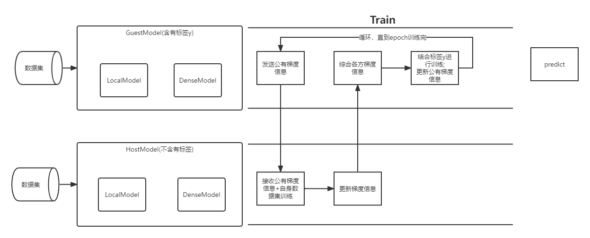

## 数据处理

**nus_wide:**
一个图片分类数据集，数据集信息直接是特征提取后的low level feature，即图片的边缘、角、颜色等，通过滤波或SIFT获取的。

另一txt文件存储数据集的标签

**数据集处理程序**
通过编写数据集处理程序，将原本的nus_wide数据集划分为纵向联邦学习的数据集。可选择分为两部分或三部分
主要函数`prepare_party_data()`
入参：

- src_data_folder：str 数据集路径
- des_data_folder：str 数据集文件名字
- selected_lables：set 标签集合
- neg_label：int 反例标签数
- n_samples：int 样本数量
- is_three_party：boolean 是否是三分，false则划分为两部分

通过selected_lables选择子数据集类别，例如["person", "animal"]

分为两部分：

A：

数据特征的A部分

B：

数据特征的B部分和标签

数据集划分：80%train 20%test

## 构建模型

使用模型：逻辑回归

## 模型训练

训练过程：参照上图

LocalModel:

DenseModel:

PartyModel:

​	GuestModel:

​	HostModel:

