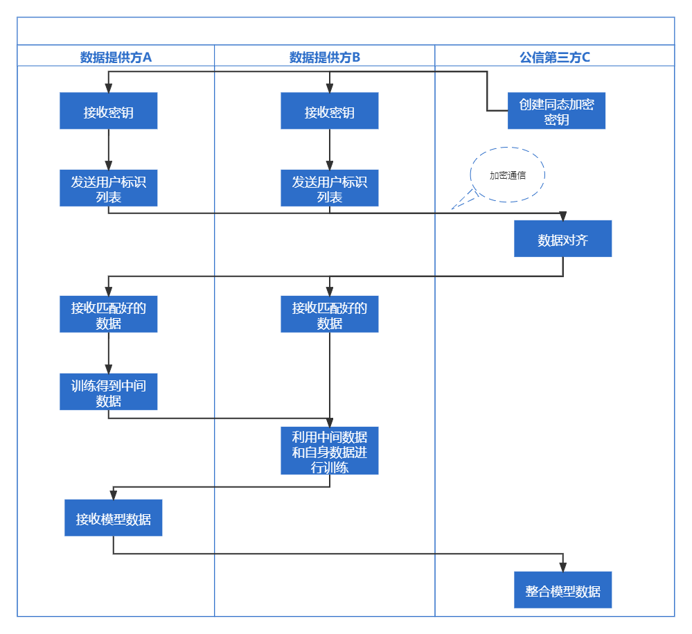

# Vertical Fedrated Learning

> Private federated learning on vertically partitioned data
> via entity resolution and additively homomorphic
> encryption
>
> https://arxiv.org/abs/1711.10677

一、提供一种端到端的纵向联邦学习方法

二、两个纵向数据集的数据特征链接方法

**可加性同态加密 Additionally Homomorphic encryption**

**隐私保护**——数据对齐

不同数据集对齐过程中的隐私保护，根据数据集中的用户标识符，如姓名、性别、生日等进行布隆过滤器编码得到一个CLK码，再将该CLK统一发给一个中立的第三方服务器。在第三方服务器中，接收到不同数据集的CLK后，通过比较计算其相似系数对不同数据集的数据进行匹配，相似的数据则被认定为在不同数据集上的同一个用户的数据。

σ，τ是在两个数据集进行相同数据匹配对齐后的数据顺序，表示两个数据集应该如何去重排他们的数据，m则表示这一行的数据是否能用于学习。每个数据方都会收到一个重排序列和一个数据是否可用的m

总体流程如下：

1. 三方服务器创建一个同态加密密钥发送给不同数据方
2. 数据方和三方服务器进行加密通信，发送自己数据的用户标识到服务器
3. 三方服务器对数据进行对齐，返回给不同数据方一个重排序列和每行数据是否可用于学习
4. 进行联邦学习训练
5. 数据方进行分批次训练，每个batch训练后进行参数交互并上传到三方服务器进行整合，数据方交互数据仅为模型权重参数和分片信息。对于训练方A和B，A和B的对齐数据需要一定的交叉计算，即A部分的计算需要使用B的数据，B部分的计算需要使用A的数据，同态加密技术用于防止A或B直接看到对方的明文数据。
6. 梯度传递过程：
   

问题：

1. 缺少像ImageNet、cifar一样的基准数据集。测试的数据集较少，用于测试的数据集也是在原有数据集上进行拆分，无法真实反映现实生活中的情况，现实数据集可能会更加混乱和一些feature丢失的情况。
2. 数据不平衡，比如某一个用户多次访问一家银行，而另一家银行仅访问一次，怎样去平衡这些数据在训练过程中的作用。

