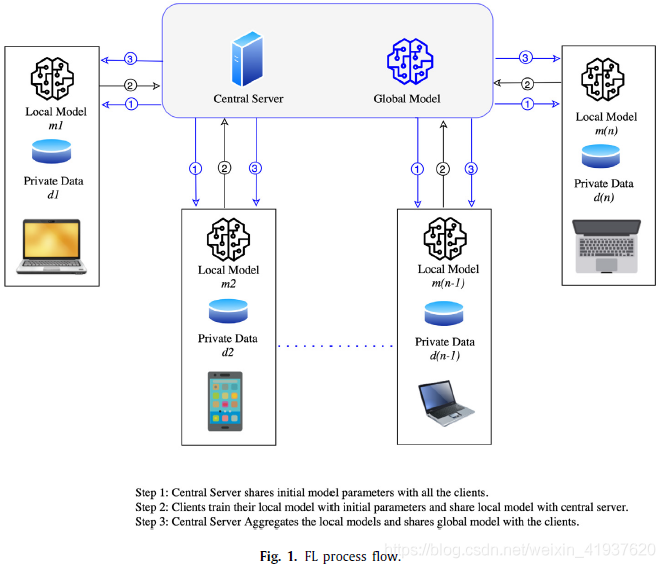

## 基础概论

什么是联邦学习：

联邦学习就是将不同设备上的训练数据整合起来，得到一个更好的训练模型，又要同时保证各客户机训练数据的隐私性。在客户端上传服务器的时候，上传的不是数据，而是本地训练的参数权重，服务器所需做的工作就是统筹这些参数权重聚合为一个模型参数权重。

​	前提：独立同分布IID：各客户机数据应该是类似的一批训练数据

联邦平均算法FedratedAveraging Algorithm：

假设：同步更新方案在各轮通信中进行；有一组固定的客户端集合，大小为K，每个客户端有固定的本地数据集。

1. 在每轮更新开始时，随机选择部分客户端，大小为C-fraction（C<=1,切片比例）
2. 然后，服务器将当前的全局算法的状态发送给这些客户（当前模型的参数）
3. 然后，每个客户端都基于全局参数及其本地数据集进行本地计算，并将更新发送到服务器；
4. 最后，服务器将这些更新应用于其全局状态，然后重复该过程

差异隐私：

## 联邦学习过程

1. 模型选择：在这个步骤中，首先启动中央预训练的ML模型（即全局模型）及初始参数，然后将全局ML模型与FL环境中的所有客户端共享。
2. 局部模型训练：在与所有客户共享初始ML模型和参数后，在客户层的初始ML模型（称为局部ML模型）用个人数据进行训练。
3. 本地模型的聚合：本地模型在客户端级别进行训练后，更新被发送到中央服务器，以聚合和训练全局模型。全局模型将被更新，改进后的模型将在各个客户机之间为下一次迭代共享。

## 联邦学习分类

### 横向联邦学习

多个数据集相同用户较少，可类比同一数据集的拆分

### 纵向联邦学习

多个数据集相同用户较多，但标签不同，可合并为一个标签更多的数据集

